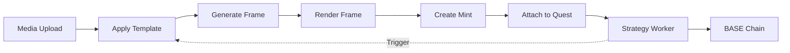
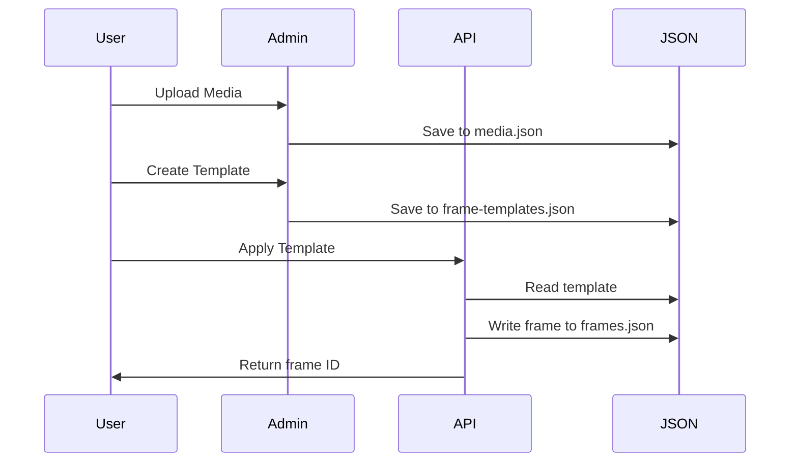
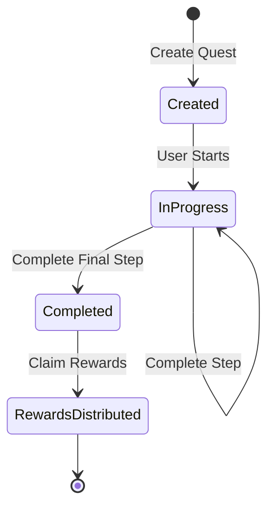
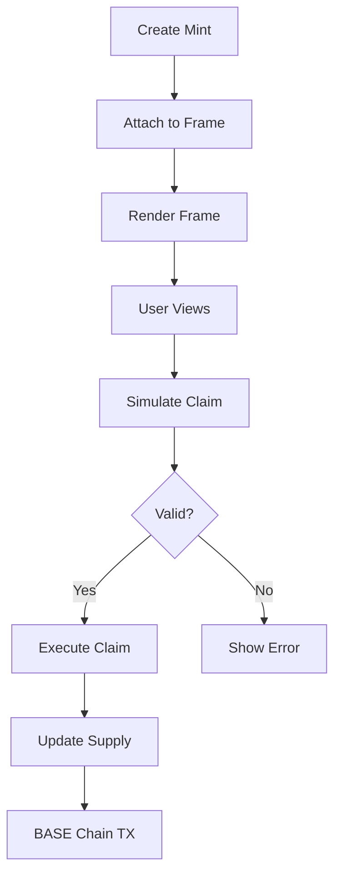
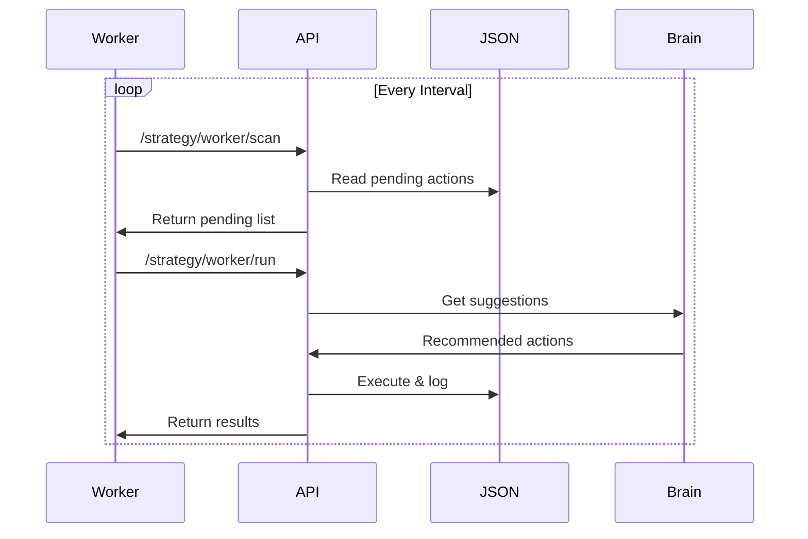
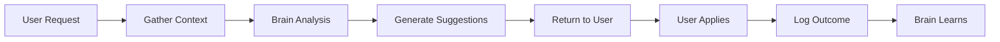
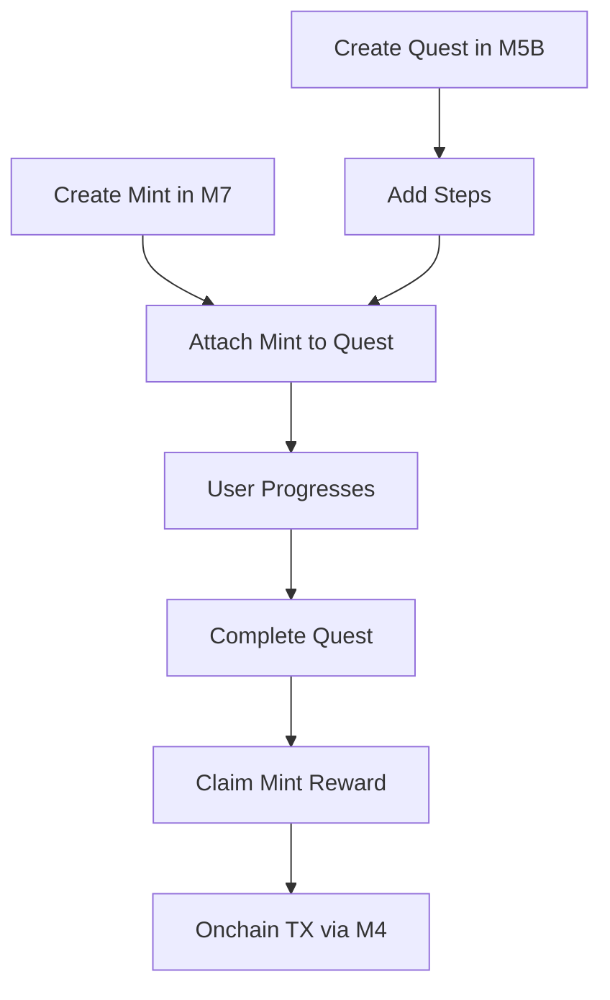
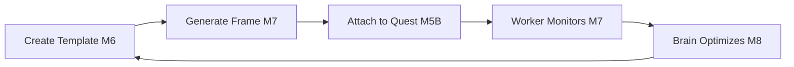

# Protocol Data Flows

This document illustrates the end-to-end data flows through the CastQuest Protocol.

## Core Pipeline

## Flow 1: Media → Frame Template → Frame

### Step-by-Step

1. **Upload Media**
   - Upload or reference media asset
   - Store in `data/media.json`

2. **Create Frame Template**
   - Define reusable template at `/frame-templates/create`
   - Set parameters and layout
   - Store in `data/frame-templates.json`

3. **Apply Template**
   - Call `/api/frame-templates/apply`
   - Provide template ID and parameters
   - Generate frame entry

4. **View Frame**
   - Navigate to `/frames/[id]`
   - Preview rendered output

### Diagram

## Flow 2: Quest Creation → Progress → Completion

### Step-by-Step

1. **Create Quest**
   - Define quest at `/quests/create`
   - Set name and description

2. **Add Steps**
   - Call `/api/quests/add-step`
   - Define step requirements

3. **Add Rewards**
   - Call `/api/quests/add-reward`
   - Attach mint or frame

4. **Track Progress**
   - Call `/api/quests/progress`
   - Update user completion

5. **Complete Quest**
   - Call `/api/quests/complete`
   - Distribute rewards

### Diagram

## Flow 3: Mint Creation → Render → Claim

### Step-by-Step

1. **Create Mint**
   - Define mint at `/mints/create`
   - Set supply and metadata

2. **Attach to Frame**
   - Call `/api/mints/attach-to-frame`
   - Link mint to frame display

3. **Render Frame**
   - Call `/api/frames/render`
   - Generate visual output

4. **Simulate Claim**
   - Call `/api/mints/simulate`
   - Validate before onchain

5. **Execute Claim**
   - Call `/api/mints/claim`
   - Update supply and ownership

### Diagram

## Flow 4: Strategy Worker Automation

### Step-by-Step

1. **Scan for Pending Actions**
   - Worker calls `/api/strategy/worker/scan`
   - Identifies pending tasks

2. **Execute Actions**
   - Worker calls `/api/strategy/worker/run`
   - Processes tasks sequentially

3. **Log Events**
   - Write to `data/worker-events.json`
   - Track success/failure

4. **Trigger Follow-ups**
   - Based on results, trigger new actions
   - Can create frames, quests, mints

### Diagram

## Flow 5: Smart Brain Suggestions

### Step-by-Step

1. **User Requests Suggestion**
   - Call `/api/brain/suggest`
   - Provide context (quest/frame/template)

2. **Brain Analyzes Context**
   - Read relevant JSON data
   - Apply heuristics and patterns

3. **Generate Suggestions**
   - Return actionable recommendations
   - Include confidence scores

4. **User Applies Suggestion**
   - Execute recommended action
   - Log outcome to brain-events.json

### Diagram

## Cross-Module Flows

### Complete Quest with Mint Reward

### Template → Frame → Quest Integration

## Next Steps

- [Module Architecture](./modules.md)
- [API Endpoints](/api/overview.md)
- [SDK Integration](/sdk/introduction.md)
