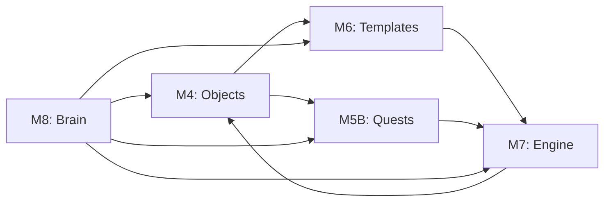

# Module Architecture

CastQuest Protocol is built with 5 core modules (M4-M8), each providing specific functionality while maintaining composability.

## Module Overview

| Module | Name | Purpose |
|--------|------|---------|
| M4 | BASE API & Objects | Core data structures and mock blockchain layer |
| M5B | Quest Engine | Multi-step quest flows with progress tracking |
| M6 | Frame Templates | Reusable frame templates with parameters |
| M7 | Mint & Render Engine | Frame rendering and mint management |
| M8 | Smart Brain | AI-powered suggestions and automation |

## Module Details

### [M4: BASE API & Objects](./modules/m4-objects.md)

Core foundational layer providing:
- Mock BASE chain API endpoints
- Core object types (frames, quests, mints, media)
- Mobile-optimized admin interface
- Strategy dashboard

**Endpoints:**
- `/api/base/mint` - Simulate onchain mints
- `/api/base/frame` - Frame data retrieval
- `/api/base/token-info` - Token metadata
- `/api/base/tx-status` - Transaction status

### [M5B: Quest Engine](./modules/m5b-quests.md)

Multi-step quest system with:
- Quest creation and management
- Step-by-step progress tracking
- Reward distribution
- Trigger-based automation

**Data Files:**
- `data/quests.json`
- `data/quest-steps.json`
- `data/quest-progress.json`
- `data/quest-rewards.json`

### [M6: Frame Templates](./modules/m6-templates.md)

Reusable template engine for frames:
- Template creation with parameters
- Template application to frames
- Parameter validation
- Visual preview

**Admin Routes:**
- `/frame-templates` - Template browser
- `/frame-templates/create` - Template builder
- `/frame-templates/[id]` - Template editor

### [M7: Mint & Render Engine](./modules/m7-engine.md)

Frame execution and mint management:
- Frame rendering pipeline
- Mint creation and simulation
- Claiming mechanics
- Quest/frame attachment

**Worker Jobs:**
- Autonomous mint processing
- Frame state updates
- Event log generation

### [M8: Smart Brain](./modules/m8-brain.md)

AI-powered intelligence layer:
- Context-aware suggestions
- Frame validation
- Autonomous operations
- Learning from events

**Capabilities:**
- Suggest quest flows
- Validate frame schemas
- Optimize strategy execution
- Generate reports

## Module Interactions



## Installation

Each module can be installed independently using the module scripts:

```bash
# Install Quest Engine
./scripts/module-5-quests-mega.sh

# Install Frame Templates
./scripts/module-6-frame-templates-mega.sh

# Install Mint Engine
./scripts/module-7-mega-engine.sh

# Install Smart Brain
./scripts/module-8-brain-mega.sh
```

## Next Steps

- [Module M4 Deep Dive](./modules/m4-objects.md)
- [Data Flow Diagrams](./flows.md)
- [API Reference](/api/overview.md)
