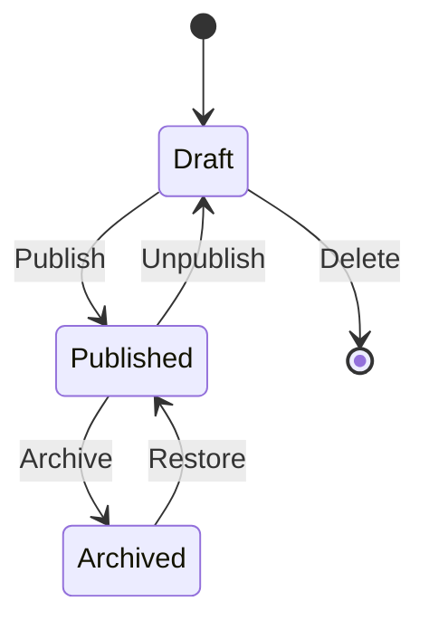

# Frames

Frames are the core building blocks of CastQuest Protocol - interactive social media posts that can be rendered, minted, and collected.

## What Are Frames?

A frame is a rich media object that combines:
- Visual content (images, videos, text)
- Interactive actions (buttons, forms)
- Onchain capabilities (minting, claiming)
- Social integration (Farcaster, etc.)

## Frame Structure

```typescript
interface Frame {
  id: string;
  templateId?: string;
  mediaId?: string;
  layout: {
    primaryText: string;
    secondaryText?: string;
    image?: string;
    cta?: {
      label: string;
      action: string;
      params?: Record<string, any>;
    };
  };
  metadata: {
    createdAt: string;
    updatedAt: string;
    author?: string;
  };
  status: 'draft' | 'published' | 'archived';
}
```

## Creating Frames

### From Scratch

Create a frame directly through the admin panel or API:

```typescript
const response = await fetch('/api/frames/create', {
  method: 'POST',
  headers: { 'Content-Type': 'application/json' },
  body: JSON.stringify({
    layout: {
      primaryText: 'Welcome to CastQuest',
      secondaryText: 'Start your journey',
      image: '/media/welcome.png',
      cta: {
        label: 'Get Started',
        action: 'navigate',
        params: { url: '/quests' }
      }
    }
  })
});

const { frame } = await response.json();
```

### From Templates

Apply a frame template with custom parameters:

```typescript
const response = await fetch('/api/frame-templates/apply', {
  method: 'POST',
  headers: { 'Content-Type': 'application/json' },
  body: JSON.stringify({
    templateId: 'template_welcome',
    params: {
      userName: 'Alice',
      questName: 'Getting Started'
    }
  })
});

const { frame } = await response.json();
```

## Frame Actions

Frames support various interactive actions:

### Navigation Actions
```typescript
cta: {
  label: 'Explore',
  action: 'navigate',
  params: { url: '/explore' }
}
```

### Mint Actions
```typescript
cta: {
  label: 'Collect',
  action: 'mint',
  params: { mintId: 'mint_123' }
}
```

### Quest Actions
```typescript
cta: {
  label: 'Start Quest',
  action: 'quest_start',
  params: { questId: 'quest_456' }
}
```

### Custom Actions
```typescript
cta: {
  label: 'Custom Action',
  action: 'custom',
  params: { handler: 'myCustomHandler' }
}
```

## Frame Rendering

Frames are rendered by the render engine:

```typescript
const response = await fetch('/api/frames/render', {
  method: 'POST',
  headers: { 'Content-Type': 'application/json' },
  body: JSON.stringify({
    frameId: 'frame_789'
  })
});

const { rendered } = await response.json();
// Returns HTML/React component ready for display
```

## Frame Lifecycle



### Draft
Initial state when a frame is created. Not visible to users.

### Published
Frame is live and visible. Can be interacted with, minted, or shared.

### Archived
Frame is preserved but hidden. Can be restored later.

## Attaching to Quests

Frames can be attached to quest steps:

```typescript
await fetch('/api/mints/attach-to-quest', {
  method: 'POST',
  body: JSON.stringify({
    frameId: 'frame_123',
    questId: 'quest_456',
    stepIndex: 2
  })
});
```

## Attaching to Mints

Frames can be converted to collectible mints:

```typescript
await fetch('/api/mints/attach-to-frame', {
  method: 'POST',
  body: JSON.stringify({
    frameId: 'frame_123',
    supply: 100,
    price: '0.001'
  })
});
```

## Best Practices

### Keep It Simple
- Focus on one clear message per frame
- Use high-quality images
- Make CTAs action-oriented

### Optimize for Mobile
- Test on mobile viewports
- Use readable font sizes
- Ensure touch targets are large enough

### Use Templates
- Create reusable templates for common patterns
- Parameterize variable content
- Maintain consistent branding

### Test Before Publishing
- Preview frames before publishing
- Verify all actions work correctly
- Check rendering on different platforms

## Frame Analytics

Track frame performance:

```typescript
const stats = await fetch(`/api/frames/${frameId}/stats`).then(r => r.json());

console.log(stats);
// {
//   views: 1250,
//   interactions: 340,
//   mints: 89,
//   shares: 45
// }
```

## Advanced Features

### Dynamic Content
Use the Smart Brain to generate dynamic content:

```typescript
const suggestion = await fetch('/api/brain/suggest', {
  method: 'POST',
  body: JSON.stringify({
    context: 'frame',
    type: 'content',
    params: { topic: 'web3' }
  })
}).then(r => r.json());
```

### Conditional Rendering
Show different content based on user state:

```typescript
{
  layout: {
    primaryText: user.hasCompleted ? 'Welcome back!' : 'Start here',
    cta: {
      label: user.hasCompleted ? 'Continue' : 'Begin',
      action: 'navigate',
      params: { url: user.hasCompleted ? '/advanced' : '/basics' }
    }
  }
}
```

## Next Steps

- [Frame Templates](/guide/concepts/templates) - Create reusable templates
- [Quests](/guide/concepts/quests) - Integrate frames with quests
- [Mints](/guide/concepts/mints) - Make frames collectible
- [API Reference](/api/endpoints/frames) - Full API documentation
