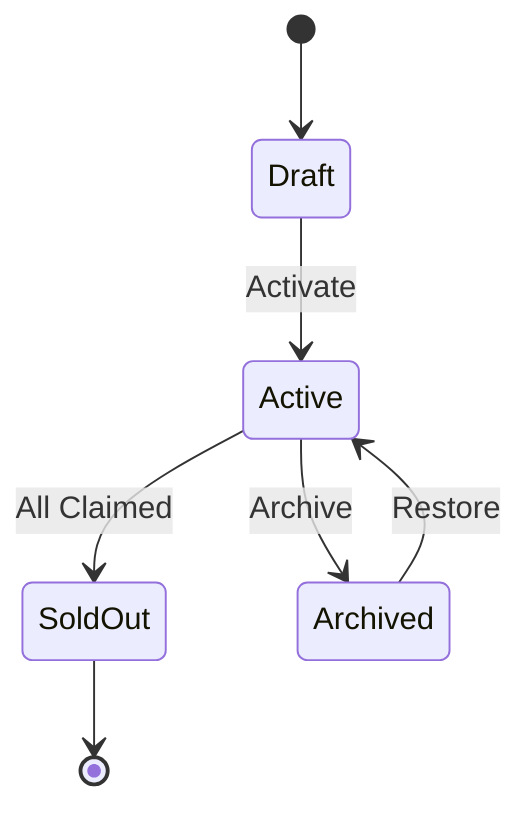

# Mints

Mints are collectible digital assets that can be claimed, traded, and attached to frames or quests.

## What Are Mints?

A mint in CastQuest represents:
- A collectible NFT or badge
- Limited or unlimited supply
- Claimable by users
- Attachable to frames and quests
- Trackable onchain (when not in mock mode)

## Mint Structure

```typescript
interface Mint {
  id: string;
  name: string;
  description: string;
  supply: number;
  claimed: number;
  price?: string;
  metadata: {
    image?: string;
    animationUrl?: string;
    attributes?: Array<{
      trait_type: string;
      value: string | number;
    }>;
  };
  chainData?: {
    contractAddress: string;
    tokenId: string;
    chainId: number;
  };
  status: 'draft' | 'active' | 'soldout' | 'archived';
  createdAt: string;
}
```

## Creating Mints

### Via Admin Panel

1. Navigate to `/mints`
2. Click "Create Mint"
3. Fill in details (name, description, supply)
4. Upload artwork
5. Set price (optional)
6. Activate the mint

### Via API

```typescript
const response = await fetch('/api/mints/create', {
  method: 'POST',
  headers: { 'Content-Type': 'application/json' },
  body: JSON.stringify({
    name: 'Founder Badge',
    description: 'Limited edition founder badge',
    supply: 100,
    price: '0.001',
    metadata: {
      image: '/media/founder-badge.png',
      attributes: [
        { trait_type: 'Rarity', value: 'Legendary' },
        { trait_type: 'Edition', value: 'Genesis' }
      ]
    }
  })
});

const { mint } = await response.json();
```

## Mint Simulation

Test mints before activating:

```typescript
const simulation = await fetch('/api/mints/simulate', {
  method: 'POST',
  headers: { 'Content-Type': 'application/json' },
  body: JSON.stringify({
    name: 'Test Mint',
    supply: 50,
    price: '0.005'
  })
}).then(r => r.json());

console.log(simulation);
// {
//   estimated: {
//     gasPerClaim: '21000',
//     totalRevenue: '0.25',
//     estimatedDuration: '2 hours'
//   }
// }
```

## Claiming Mints

Users can claim available mints:

```typescript
const response = await fetch('/api/mints/claim', {
  method: 'POST',
  headers: { 'Content-Type': 'application/json' },
  body: JSON.stringify({
    mintId: 'mint_123',
    userId: 'user_456',
    quantity: 1,
    payment: {
      method: 'eth',
      txHash: '0x...'
    }
  })
});

const { success, tokenId } = await response.json();
```

## Attaching to Frames

Make frames collectible by attaching mints:

```typescript
await fetch('/api/mints/attach-to-frame', {
  method: 'POST',
  headers: { 'Content-Type': 'application/json' },
  body: JSON.stringify({
    mintId: 'mint_123',
    frameId: 'frame_456'
  })
});
```

Now when users interact with the frame, they can claim the mint.

## Attaching to Quests

Use mints as quest rewards:

```typescript
await fetch('/api/mints/attach-to-quest', {
  method: 'POST',
  headers: { 'Content-Type': 'application/json' },
  body: JSON.stringify({
    mintId: 'mint_123',
    questId: 'quest_789',
    stepIndex: -1  // -1 = completion reward
  })
});
```

## Mint Types

### Limited Edition
Fixed supply, first-come-first-served:

```typescript
{
  name: 'Genesis Collection',
  supply: 100,
  claimed: 45
}
```

### Open Edition
Unlimited supply, time-limited:

```typescript
{
  name: 'Open Mint',
  supply: -1,  // Unlimited
  constraints: {
    endTime: '2025-12-31T23:59:59Z'
  }
}
```

### Free Mint
No payment required:

```typescript
{
  name: 'Free Starter Badge',
  supply: 1000,
  price: '0'  // Free
}
```

### Paid Mint
Requires payment:

```typescript
{
  name: 'Premium Collectible',
  supply: 500,
  price: '0.01'  // 0.01 ETH
}
```

## Mint Events

Track mint-related events:

```typescript
// Get mint events
const events = await fetch(`/api/mints/${mintId}/events`)
  .then(r => r.json());

console.log(events);
// [
//   {
//     type: 'claim',
//     userId: 'user_123',
//     tokenId: '42',
//     timestamp: '2025-01-15T10:30:00Z'
//   },
//   ...
// ]
```

## Mint Lifecycle



## Onchain Integration

### BASE Chain (Mock Mode)

In development, mints use mock onchain behavior:

```typescript
// Mock mint (no actual blockchain transaction)
const result = await fetch('/api/base/mint', {
  method: 'POST',
  body: JSON.stringify({
    mintId: 'mint_123',
    recipient: '0x...'
  })
}).then(r => r.json());

console.log(result);
// {
//   success: true,
//   txHash: 'mock_0x123...',
//   tokenId: '42'
// }
```

### BASE Chain (Production)

In production, mints interact with actual BASE contracts:

```typescript
{
  chainData: {
    contractAddress: '0x1234...5678',
    tokenId: '42',
    chainId: 8453  // BASE mainnet
  }
}
```

## Metadata Standards

Mints follow NFT metadata standards:

```json
{
  "name": "Founder Badge #42",
  "description": "Limited edition founder badge",
  "image": "ipfs://Qm.../image.png",
  "animation_url": "ipfs://Qm.../animation.mp4",
  "attributes": [
    {
      "trait_type": "Rarity",
      "value": "Legendary"
    },
    {
      "trait_type": "Edition",
      "value": "Genesis"
    },
    {
      "trait_type": "Serial Number",
      "value": 42
    }
  ]
}
```

## Mint Analytics

Track mint performance:

```typescript
const stats = await fetch(`/api/mints/${mintId}/stats`)
  .then(r => r.json());

console.log(stats);
// {
//   totalClaims: 45,
//   uniqueClaimers: 42,
//   revenue: '0.45',
//   claimRate: '45%',
//   averageClaimTime: '2.5 hours',
//   topCollectors: [...]
// }
```

## Best Practices

### Design Collectibles
- Create visually appealing artwork
- Add meaningful attributes
- Consider rarity and scarcity
- Make them shareable

### Set Appropriate Supply
- Limited for exclusivity
- Open edition for accessibility
- Consider demand vs. supply
- Monitor claim rates

### Price Fairly
- Research market rates
- Consider gas costs
- Offer free options for onboarding
- Test with simulations

### Promote Effectively
- Attach to quests for discovery
- Feature in frames
- Share on social media
- Create urgency with limited time

## Advanced Features

### Dynamic Pricing
Adjust price based on demand:

```typescript
{
  pricing: {
    type: 'bonding_curve',
    startPrice: '0.001',
    curve: 'linear',
    increment: '0.0001'
  }
}
```

### Whitelisted Claims
Restrict claims to specific users:

```typescript
{
  accessControl: {
    type: 'whitelist',
    addresses: ['0x...', '0x...']
  }
}
```

### Batch Minting
Create multiple tokens at once:

```typescript
await fetch('/api/mints/batch-claim', {
  method: 'POST',
  body: JSON.stringify({
    mintId: 'mint_123',
    userId: 'user_456',
    quantity: 5
  })
});
```

### Royalties
Set creator royalties:

```typescript
{
  royalties: {
    recipient: '0x...',
    percentage: 5  // 5%
  }
}
```

## Next Steps

- [Frames](/guide/concepts/frames) - Attach mints to frames
- [Quests](/guide/concepts/quests) - Use mints as rewards
- [Templates](/guide/concepts/templates) - Mint template patterns
- [API Reference](/api/endpoints/mints) - Full API documentation
