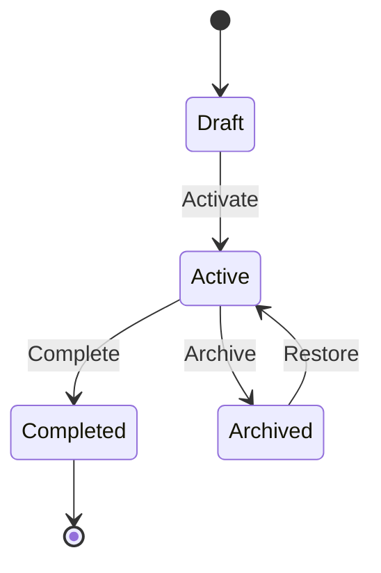

# Quests

Quests are multi-step challenges that guide users through experiences while tracking progress and rewarding completion.

## What Are Quests?

A quest in CastQuest is:
- A sequence of steps users complete
- Progress tracking for each user
- Rewards upon completion
- Flexible validation logic

## Quest Structure

```typescript
interface Quest {
  id: string;
  name: string;
  description: string;
  steps: QuestStep[];
  rewards: QuestReward[];
  status: 'draft' | 'active' | 'completed' | 'archived';
  metadata: {
    createdAt: string;
    updatedAt: string;
    author?: string;
  };
}

interface QuestStep {
  id: string;
  questId: string;
  stepIndex: number;
  stepType: 'social' | 'action' | 'mint' | 'custom';
  description: string;
  requirement: string;
  params?: Record<string, any>;
}

interface QuestReward {
  id: string;
  questId: string;
  type: 'badge' | 'nft' | 'token' | 'points';
  title: string;
  description: string;
  metadata?: Record<string, any>;
}
```

## Creating Quests

### Via Admin Panel

1. Navigate to `/quests/create`
2. Enter quest name and description
3. Add steps
4. Configure rewards
5. Activate the quest

### Via API

```typescript
// Create the quest
const quest = await fetch('/api/quests/create', {
  method: 'POST',
  headers: { 'Content-Type': 'application/json' },
  body: JSON.stringify({
    name: 'Welcome Quest',
    description: 'Get started with CastQuest'
  })
}).then(r => r.json());

// Add steps
await fetch('/api/quests/add-step', {
  method: 'POST',
  body: JSON.stringify({
    questId: quest.quest.id,
    stepType: 'social',
    description: 'Follow us on Farcaster',
    requirement: 'follow',
    params: { account: 'castquest' }
  })
});

// Add rewards
await fetch('/api/quests/add-reward', {
  method: 'POST',
  body: JSON.stringify({
    questId: quest.quest.id,
    type: 'badge',
    title: 'Early Adopter',
    description: 'Completed the Welcome Quest'
  })
});
```

## Quest Step Types

### Social Steps
Verify social media actions:

```typescript
{
  stepType: 'social',
  description: 'Follow @CastQuest',
  requirement: 'follow',
  params: {
    platform: 'farcaster',
    account: 'castquest'
  }
}
```

### Action Steps
Complete specific actions:

```typescript
{
  stepType: 'action',
  description: 'Create your first frame',
  requirement: 'frame_create',
  params: {
    minFrames: 1
  }
}
```

### Mint Steps
Claim collectibles:

```typescript
{
  stepType: 'mint',
  description: 'Collect the starter badge',
  requirement: 'mint_claim',
  params: {
    mintId: 'mint_starter_badge'
  }
}
```

### Custom Steps
Custom validation logic:

```typescript
{
  stepType: 'custom',
  description: 'Complete the puzzle',
  requirement: 'custom_puzzle',
  params: {
    validatorFunction: 'validatePuzzle',
    difficulty: 'medium'
  }
}
```

## Progress Tracking

Track user progress through quests:

```typescript
// Get user progress
const progress = await fetch(
  `/api/quests/progress?questId=${questId}&userId=${userId}`
).then(r => r.json());

console.log(progress);
// {
//   questId: 'quest_123',
//   userId: 'user_456',
//   completedSteps: [0, 1],
//   currentStep: 2,
//   totalSteps: 5,
//   status: 'in_progress',
//   startedAt: '2025-01-15T10:00:00Z'
// }
```

## Completing Steps

Users complete steps by triggering the appropriate action:

```typescript
await fetch('/api/quests/complete', {
  method: 'POST',
  headers: { 'Content-Type': 'application/json' },
  body: JSON.stringify({
    questId: 'quest_123',
    userId: 'user_456',
    stepIndex: 2,
    proof: {
      // Step-specific validation data
      txHash: '0x...',
      timestamp: Date.now()
    }
  })
});
```

## Quest Rewards

### Badge Rewards
Visual achievement badges:

```typescript
{
  type: 'badge',
  title: 'Quest Master',
  description: 'Completed 10 quests',
  metadata: {
    imageUrl: '/badges/quest-master.png',
    rarity: 'rare'
  }
}
```

### NFT Rewards
Onchain collectibles:

```typescript
{
  type: 'nft',
  title: 'Legendary Sword',
  description: 'A powerful weapon',
  metadata: {
    contractAddress: '0x...',
    tokenId: '123',
    chainId: 8453
  }
}
```

### Token Rewards
Fungible tokens:

```typescript
{
  type: 'token',
  title: 'Quest Points',
  description: 'Earn points for completing quests',
  metadata: {
    amount: '100',
    tokenAddress: '0x...'
  }
}
```

## Quest Lifecycle



## Strategy Worker Integration

The Strategy Worker can automatically trigger quest-related actions:

```typescript
// Worker configuration
{
  "trigger": "quest_step_complete",
  "actions": [
    {
      "type": "send_notification",
      "params": { "message": "Quest step completed!" }
    },
    {
      "type": "update_progress",
      "params": { "advance": true }
    },
    {
      "type": "check_completion",
      "params": { "award_rewards": true }
    }
  ]
}
```

## Quest Patterns

### Linear Quest
Simple sequential steps:

```
Step 1 → Step 2 → Step 3 → Complete
```

### Branching Quest
Multiple paths to completion:

```
Step 1 → Choice
  ├─ Path A → Step 2A → Step 3A
  └─ Path B → Step 2B → Step 3B
Both paths → Complete
```

### Parallel Quest
Complete steps in any order:

```
Step 1 ──┐
Step 2 ──┼─→ All Complete → Reward
Step 3 ──┘
```

### Daily Quest
Time-limited recurring quest:

```typescript
{
  name: 'Daily Challenge',
  constraints: {
    recurring: 'daily',
    resetTime: '00:00 UTC'
  }
}
```

## Best Practices

### Design Engaging Quests
- Start with easy steps to build momentum
- Mix different step types for variety
- Make objectives clear and achievable
- Provide meaningful rewards

### Validate Carefully
- Use appropriate validation for each step type
- Prevent cheating with proper verification
- Handle edge cases gracefully
- Log all validation attempts

### Track Progress
- Store progress data reliably
- Allow users to resume incomplete quests
- Show clear progress indicators
- Notify users of milestones

### Reward Generously
- Make rewards worth the effort
- Provide both immediate and long-term value
- Consider rarity and exclusivity
- Celebrate completion

## Advanced Features

### Prerequisite Quests
Require completion of other quests:

```typescript
{
  name: 'Advanced Quest',
  prerequisites: ['quest_basics', 'quest_intermediate']
}
```

### Quest Chains
Link quests together:

```typescript
{
  name: 'Chapter 2',
  previousQuest: 'quest_chapter_1',
  nextQuest: 'quest_chapter_3'
}
```

### Conditional Steps
Show steps based on user state:

```typescript
{
  stepType: 'conditional',
  condition: 'user.level >= 5',
  thenStep: { ... },
  elseStep: { ... }
}
```

## Next Steps

- [Frames](/guide/concepts/frames) - Integrate frames with quests
- [Mints](/guide/concepts/mints) - Add collectible rewards
- [Smart Brain](/guide/concepts/smart-brain) - AI-powered quest suggestions
- [API Reference](/api/endpoints/quests) - Full API documentation
