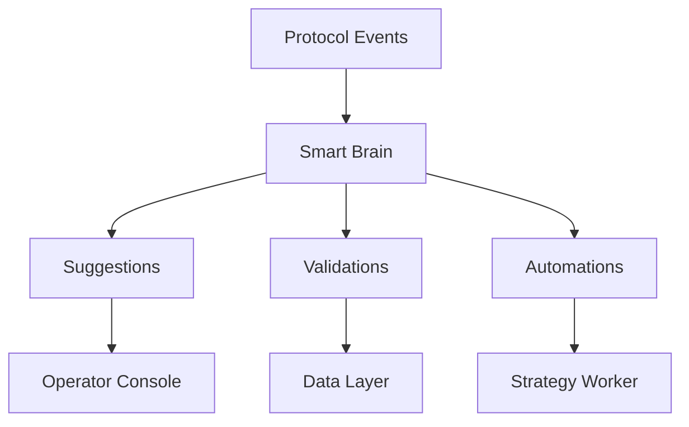

# Smart Brain

The Smart Brain is CastQuest's AI-powered automation and intelligence layer that provides suggestions, validation, and autonomous operations.

## What Is Smart Brain?

Smart Brain is an AI agent system that:
- Analyzes protocol activity
- Suggests improvements
- Validates data
- Automates routine tasks
- Learns from patterns

## Architecture



## Core Capabilities

### 1. Suggestions

Get AI-powered recommendations:

```typescript
const response = await fetch('/api/brain/suggest', {
  method: 'POST',
  headers: { 'Content-Type': 'application/json' },
  body: JSON.stringify({
    context: 'quest',
    type: 'design',
    params: {
      objective: 'increase_completion_rate',
      currentRate: 0.45
    }
  })
});

const { suggestions } = await response.json();
console.log(suggestions);
// [
//   "Add intermediate checkpoints every 3 steps",
//   "Provide visual progress indicators",
//   "Offer hint system for stuck users"
// ]
```

### 2. Validation

Validate data before it enters the system:

```typescript
const validation = await fetch('/api/brain/validate', {
  method: 'POST',
  headers: { 'Content-Type': 'application/json' },
  body: JSON.stringify({
    type: 'frame',
    data: {
      layout: {
        primaryText: 'Hello World',
        cta: { label: 'Click', action: 'navigate' }
      }
    }
  })
}).then(r => r.json());

console.log(validation);
// {
//   valid: false,
//   errors: ["CTA missing required 'params' field"],
//   suggestions: ["Add params: { url: '...' } to CTA"]
// }
```

### 3. Automation

Trigger autonomous actions:

```typescript
const automation = await fetch('/api/brain/automate', {
  method: 'POST',
  headers: { 'Content-Type': 'application/json' },
  body: JSON.stringify({
    task: 'optimize_quest_steps',
    questId: 'quest_123',
    constraints: {
      maxSteps: 5,
      targetCompletion: 0.70
    }
  })
}).then(r => r.json());

console.log(automation);
// {
//   status: 'completed',
//   changes: [
//     "Merged steps 2 and 3 (similar objectives)",
//     "Simplified step 4 validation",
//     "Added progress checkpoint after step 3"
//   ],
//   projectedCompletion: 0.68
// }
```

## Configuration

Configure Smart Brain in your environment:

```bash
# .env.local
SMART_BRAIN_ENABLED=true
SMART_BRAIN_MODEL=gpt-4
OPENAI_API_KEY=sk-...

# Brain behavior settings
BRAIN_SUGGESTION_THRESHOLD=0.7
BRAIN_AUTO_VALIDATE=true
BRAIN_AUTO_FIX=false  # Requires operator approval
```

## Suggestion Types

### Quest Suggestions

Improve quest design:

```typescript
{
  context: 'quest',
  type: 'design',
  params: {
    questId: 'quest_123',
    metric: 'completion_rate'
  }
}
```

### Frame Suggestions

Optimize frame engagement:

```typescript
{
  context: 'frame',
  type: 'engagement',
  params: {
    frameId: 'frame_456',
    currentCTR: 0.12
  }
}
```

### Template Suggestions

Create better templates:

```typescript
{
  context: 'template',
  type: 'layout',
  params: {
    purpose: 'announcement',
    style: 'modern'
  }
}
```

### Pricing Suggestions

Optimize mint pricing:

```typescript
{
  context: 'mint',
  type: 'pricing',
  params: {
    mintId: 'mint_789',
    supply: 100,
    targetRevenue: '1.0'
  }
}
```

## Validation Rules

Smart Brain validates against:

### Schema Validation
- Required fields present
- Correct data types
- Valid enums and ranges

### Business Logic
- Quest steps are achievable
- Frame CTAs are functional
- Mint economics are sound

### Best Practices
- Accessibility guidelines
- Performance considerations
- User experience patterns

### Security
- No injection vulnerabilities
- Safe parameter handling
- Proper access controls

## Learning & Training

Smart Brain improves over time:

### Event Tracking

```typescript
// Smart Brain logs all events
const events = await fetch('/api/brain/events')
  .then(r => r.json());

console.log(events);
// [
//   {
//     timestamp: '2025-01-15T10:30:00Z',
//     type: 'suggestion_accepted',
//     context: 'quest_design',
//     suggestion: 'Add progress bar',
//     outcome: 'completion_rate_improved'
//   },
//   ...
// ]
```

### Training Data

Brain learns from:
- Successful quest completions
- High-engagement frames
- Effective templates
- Operator feedback

### Custom Training

Train on your own patterns:

```typescript
await fetch('/api/brain/train', {
  method: 'POST',
  body: JSON.stringify({
    type: 'quest_pattern',
    examples: [
      {
        structure: [...],
        completionRate: 0.85,
        label: 'highly_effective'
      }
    ]
  })
});
```

## Integration with Strategy Worker

Smart Brain powers the Strategy Worker:

```typescript
// Strategy Worker configuration
{
  "brain_enabled": true,
  "auto_suggestions": true,
  "auto_validations": true,
  "learning_mode": "active"
}
```

The worker uses Brain to:
- Detect anomalies
- Suggest optimizations
- Validate operations
- Predict outcomes

## Brain Events

Track Brain activity:

```bash
# View brain events
cat data/brain-events.json

# View suggestions
cat data/brain-suggestions.json
```

Example brain event:

```json
{
  "id": "event_123",
  "timestamp": "2025-01-15T10:30:00Z",
  "type": "suggestion",
  "context": {
    "entity": "quest",
    "entityId": "quest_123"
  },
  "suggestion": {
    "type": "optimization",
    "message": "Consider adding a checkpoint after step 3",
    "confidence": 0.85,
    "reasoning": "Users often abandon at step 4"
  },
  "action": "pending"
}
```

## Operator Controls

Control Brain behavior from admin panel:

### Suggestion Approval

```typescript
await fetch('/api/brain/approve-suggestion', {
  method: 'POST',
  body: JSON.stringify({
    suggestionId: 'sugg_123',
    approved: true,
    notes: 'Good suggestion, implementing'
  })
});
```

### Auto-Apply Rules

Configure which suggestions apply automatically:

```typescript
{
  autoApplyRules: {
    validation_fixes: true,  // Auto-fix validation errors
    minor_optimizations: true,  // Apply minor tweaks
    structural_changes: false  // Require approval
  }
}
```

### Brain Analytics

Monitor Brain performance:

```typescript
const analytics = await fetch('/api/brain/analytics')
  .then(r => r.json());

console.log(analytics);
// {
//   totalSuggestions: 245,
//   acceptedSuggestions: 180,
//   acceptanceRate: 0.73,
//   avgConfidence: 0.82,
//   topSuggestionTypes: [
//     { type: 'quest_optimization', count: 89 },
//     { type: 'frame_engagement', count: 67 }
//   ]
// }
```

## Advanced Features

### Multi-Model Support

Use different AI models:

```bash
# GPT-4 for complex reasoning
BRAIN_MODEL_COMPLEX=gpt-4

# GPT-3.5 for simple tasks
BRAIN_MODEL_SIMPLE=gpt-3.5-turbo

# Local models for privacy
BRAIN_MODEL_LOCAL=llama-2-70b
```

### Custom Prompts

Customize Brain prompts:

```typescript
{
  prompts: {
    quest_suggestion: `
      Analyze this quest: {quest}
      Current completion rate: {rate}
      Suggest improvements focusing on: {focus}
    `,
    frame_validation: `
      Validate this frame: {frame}
      Check for: {rules}
      Return errors and suggestions.
    `
  }
}
```

### A/B Testing

Test Brain suggestions:

```typescript
await fetch('/api/brain/ab-test', {
  method: 'POST',
  body: JSON.stringify({
    suggestionId: 'sugg_123',
    variants: ['original', 'suggested'],
    duration: '7d',
    metrics: ['completion_rate', 'engagement']
  })
});
```

## Best Practices

### Review Suggestions
- Don't blindly accept all suggestions
- Consider context and goals
- Test before applying to production

### Monitor Performance
- Track Brain accuracy
- Review failed suggestions
- Adjust confidence thresholds

### Provide Feedback
- Mark good/bad suggestions
- Add context for decisions
- Help Brain learn your preferences

### Respect Privacy
- Don't send sensitive user data
- Anonymize where possible
- Follow data protection regulations

## Troubleshooting

### Low Quality Suggestions

- Increase confidence threshold
- Provide more training data
- Review Brain configuration

### False Positives

- Adjust validation rules
- Add context to requests
- Fine-tune model settings

### Performance Issues

- Use faster models for simple tasks
- Cache frequent suggestions
- Batch validation requests

## Next Steps

- [Strategy Worker](/guide/concepts/strategy-worker) - Automated operations
- [API Reference](/api/endpoints/brain) - Full API documentation
- [Architecture](/architecture/modules/m8-brain) - Brain architecture details
