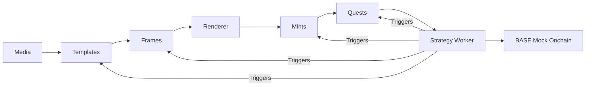

# Introduction

Welcome to CastQuest Protocol — a sovereign, media-first protocol for building composable experiences on Farcaster.

## What is CastQuest?

CastQuest transforms the way you think about social media protocols:

**Media → Templates → Frames → Render → Mints → Quests → Strategy → Onchain**

It's an operator-controlled automation spine that gives you complete transparency and control.

## Core Principles

### 🔓 Sovereignty First
- Run everything locally
- Inspect all data flows
- No vendor lock-in
- Complete operational control

### 📊 Transparency
- JSON data surfaces for everything
- Clear, auditable logs
- Explicit flows (no hidden magic)
- Open source and inspectable

### 🧩 Modularity
- Five self-contained modules (M4-M8)
- Script-installable components
- Mix and match as needed
- Easy to extend or replace

### 🎨 Expressiveness
- Rich visual frames
- Dynamic quest experiences
- Customizable templates
- Media-first design

## Who Is This For?

### Protocol Operators
Run and manage your own CastQuest instance with full visibility into all operations.

### Developers
Extend the protocol with custom modules, frames, and quest logic using our SDK.

### Designers
Create beautiful frame templates and quest experiences without writing code.

### Strategy Authors
Build automation workflows that respond to protocol events and trigger actions.

## What Can You Build?

- **Social Quests** - Multi-step challenges with onchain rewards
- **Collectible Frames** - Mintable social media posts with rich interactions
- **Dynamic Templates** - Reusable frame designs with parameter substitution
- **Automated Workflows** - Strategy workers that respond to events
- **Custom Experiences** - Combine frames, quests, and mints in novel ways

## Architecture at a Glance

## Next Steps

Ready to get started?

- [Installation](/guide/installation) - Set up your development environment
- [Quick Start](/guide/quick-start) - Create your first quest
- [Architecture Overview](/architecture/overview) - Understand the system design
- [API Reference](/api/overview) - Explore the API endpoints
